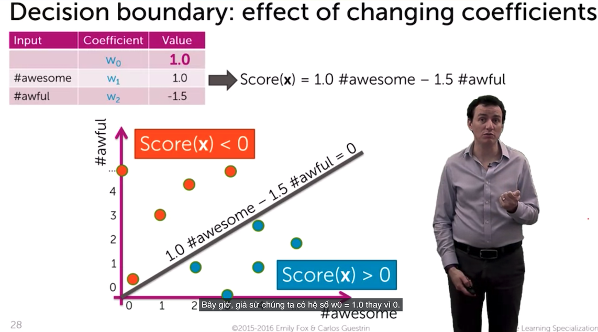

# Giới thiệu về bài toán Phân Loại

## Định nghĩa

Classifier (bộ phân loại) xem xét đầu vào - x hoặc một số đặc trưng của dữ liệu và đưa ra dự đoán đầu ra - y là một lớp rời rạc hoặc hạng mục hoặc nhãn cho dữ liệu. Một cách tóm tắt, mục tiêu của phân loại là tìm hiểu ánh xạ từ đầu vào x đến đầu ra y.

Có lẽ phân loại phổ biến nhất mà chúng ta thấy hàng ngày mỗi khi mở email là spam filter (bộ lọc thư rác). Spam filter sẽ hoạt động mỗi khi có email đến, dự đoán xem đó có là spam hay không, có nên bỏ qua hay cho vào spam.

## Tác dụng của phân loại

Phân loại là một phần cốt lõi của tất cả các công nghệ mà chúng ta thích. Có thể là spam filter mà chúng ta đã nói đến, xử lý email, những điều sẽ xảy ra khi nhập trên web search và nhận lại một tập hợp câu trả lời cụ thể, những thứ hiển thị cho bạn, các sản phẩm được đề xuất và cách chúng ta phân loại điều kiện y tế,...

Và điều thú vị về phân loại là những kỹ thuật cơ bản mà chúng ta cần để xây dựng một bộ phân loại rất giống với những kỹ thuật xây dựng tất cả các mô hình học máy khác. Vì vậy, nếu chúng ta thực sự hiểu rõ phân loại thì sẽ có thể thực hiện tất cả các loại học máy, học có giám sát.

## Khác nhau giữa phân loại và hồi quy

- Ánh xạ trong bài toán hồi quy trả về cho chúng ta một giá trị liên tục.
- Ánh xạ trong bài toán phân loại, kết quả chúng ta nhận được là một nhãn rời rạc.

## Ví dụ về phân loại tuyến tính

Trong lĩnh vực học máy, mục tiêu của phân loại thống kê là sử dụng các đặc điểm của một đối tượng để xác định nó thuộc về phân lớp nào. Một bộ phân loại tuyến tính đạt được điều này bằng cách đưa ra quyết định phân loại dựa trên giá trị của sự kết hợp tuyến tính của các đặc trưng.

## Trực giác (intuition) đằng sau phân loại tuyến tính

**Training a classifier = Learning the coefficients**

## Decision boundaries - Ranh giới quyết định

> Decision boundary separates positive and negative predictions

- For linear classifiers:
  - When 2 coefficients are non-zero -> **Line**
  - When 3 coefficients are non-zero -> **Plane**
  - When mant coefficients are non-zerp -> **Hyperplane**
- For more general classifiers
  - more complicated shapes

## Linear classifier model - Mô hình phân loại tuyến tính

Tiếp tục với ví dụ phân tích cảm xúc

**General notaiton**

- Output: $y$
- Inputs: $x = (x[1], x[2],...,x[d])$ , $x$ is $n-dim vector$
- Notational conventions
  - $x[j]$ = $j^{th}$ input (scalar)
  - $h_{j}(x)$ = $j^{th}$ feature (scalar)
  - $x_{i}$ = input of $i^{th}$ data point (vector)
  - $x_{i}[j]$ = $j^{th}$ input of $i^{th}$ data point (scalar)

**Simple hyperplane**

Model: $\hat{y} = sign(Score(x_{i}))$

$Score(x_{i}) = w_{0} + w_{1}x_{i}[1] + ... + w_{d}x_{i}[d] = \textbf{W}^{T}x_{i}$

- $ feature 1 = 1$

- $feature 2 = x[1] ... eg: \#awesome$

- $feature 3 = x[3] ... eg: \#awful$ 

  ...

- $feature d+1 = x[d] ... eg: \#ramen$

## Ảnh hưởng của các hệ số đến ranh giới quyết định

## Sử dụng đặc trưng đầu vào

Ký hiệu mà chúng ta đã sử dụng cho tới nay không có các đặc trưng liên quan đến nó, nhưng như trong khóa học hồi quy, chúng ta sẽ tập trung vào việc giới thiệu đặc trưng ngay từ đầu. Vì vậy, chúng ta sẽ có các hàm $h_{1}$ cho tới $h_{d}$, chúng xác định một số đặc trưng chúng ta có thể trích xuất từ dữ liệu. Và chúng ta sẽ mã hóa hàm hằng số đó là $h_{0}$.

Model: $\hat{y} = sign(Score(x_{i}))$

$Score(x_{i}) = w_{0}h_{0}(x_{i}) + w_{1}h_{1}(x_{i}) + ... + w_{d}h_{d}(x_{i}) = \textbf{W}^{T}h(x)$

- $feature 1 = h_{0}(x) ... $e.g., 1

- $feature2 = h_{1}(x) ... e.g., x[1] =$ #awesome

- $feature 3 = h_{2}(x) ... e.g., x[2] =$ #awful or  $tf-idf('awful')$

  ...

- $feature D+1 = h_{D}(x)$ ... some other function of $x[1], x[2] ... x[D]$

## Dự đoán xác suất phân loại

Chúng ta sẽ đi sâu hơn nhiều vào các khái niệm cơ bản liên quan đến **hồi quy logistic**. Cụ thể, trong hồi quy logistic, chúng ta không chỉ dự đoán **+1** hoặc **-1** mà còn dự đoán xác suất. Bình luận này có khả năng tích cực hay tiêu cực như thế nào? Những xác suất này cực kỳ hữu ích vì chúng cho thấy mức độ chắc chắn về những dự đoán chúng ta đưa ra.

## Sử dụng xác suất phân loại

