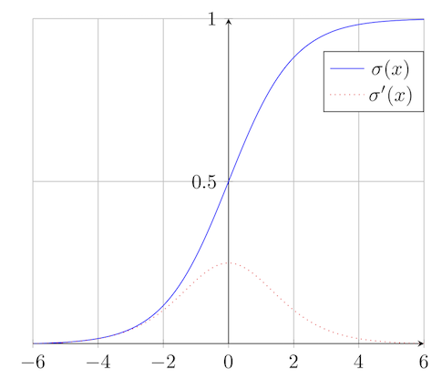
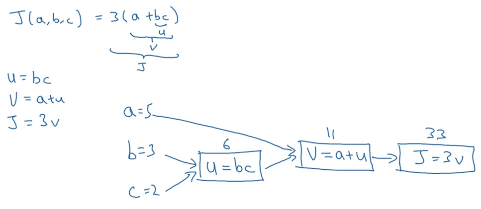
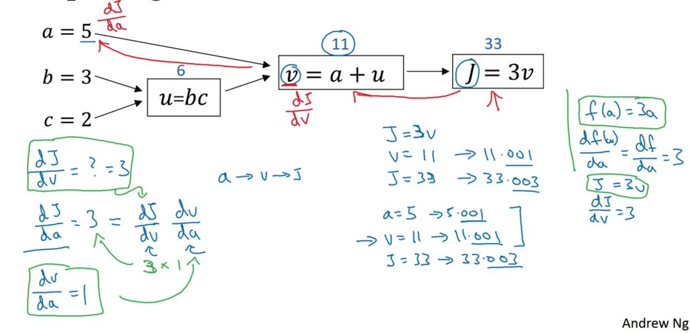
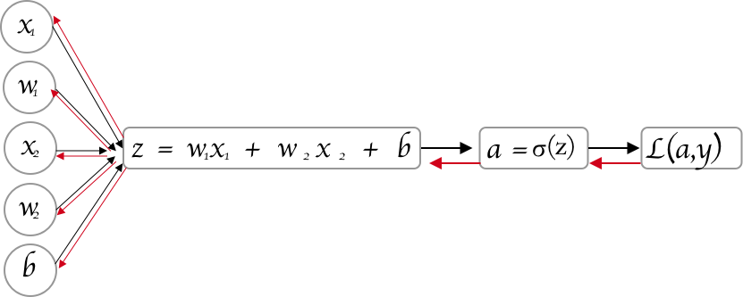

# Gradient Decent với Logistic regression

## Binary Classification


- $(x, y)  \left \{
    \begin{aligned}
      &x \in \mathrm{R}^{n} \\
      &y \in \{0,1\} \\
    \end{aligned} \right.$
- $m$ training example : $\{(x^{(1)}, y^{(1)}), (x^{(2)}, y^{(2)}), ..., (x^{(m)}, y^{(m)})\}$
- $\textbf{X} = \begin{bmatrix}
  \vdots  & \vdots  & \vdots & \vdots\\
   x^{(1)} & x^{(2)} & \cdots   & x^{(m)} \\
   \vdots & \vdots & \vdots & \vdots
  \end{bmatrix} \in \mathbb{R}^{(n\times m)}$
- $\textbf{X}.shape = (n, m)$
- $\textbf{y} = [y^{(1)}, y^{(2)} ... , y^{(m)}]$
- $\textbf{y}.shape = (1,m)$

**Note**: trong ký hiệu này thì, mỗi cột là một observation. Trong một số tài liệu, hoặc theo những gì thường được ký hiệu trong các phần trước, thường sẽ biểu diễn trong một ma trận $\mathbb{R}^{(m\times n)}$ với $m$ hàng tương ứng với $m$ observations.

Nhưng trong tài liệu này sẽ biểu diễn ngược lại, điều đó sẽ thuận lợi hơn, dễ triển khai hơn trong neural network

## Logistic Regression

Given $\textbf{x}$ , want $\hat{y} = P(y=1 | x)$ - Xác suất để y = 1khi $x$ xảy ra.

-  $\textbf{x} \in\mathbb{R}^{n}$

- parameters: $\textbf{w} \in \mathbb{R}^{n}$, $b \in \mathbb{R}$

- $\hat{y} = \textbf{w}^{T}x + b$ 

  đây là một hàm tuyến tính của đầu vào $\textbf{x}$, trên thực tế thì đây là những gì bạn thực hiện trên hồi quy tuyến tính nhưng đây không phải là một thuật toán hiệu quả để phân loại nhị phân.

  Hơn nữa, $\hat{y}$ nhận giá trị từ $0 -> 1$, do đó, với Logistic regression, hàm tính $\hat{y}$ như sau:

$$
\hat{y} =\sigma(\textbf{w}^{T}x + b)
$$

Đây gọi là hàm **sigmoid**



<center>Đồ thị hàm <b>sigmoid</b></center>

Công thức hàm **sigmoid**
$$
\sigma(z) = \frac{1}{1+e^{-z}}
$$
**Lưu ý:**

- Nếu $z$ cực lớn thì $e^{-z}$ tiến đến 0 do đó $\sigma(z)$ tiến đến 1.
- Nếu $z$ cực nhỏ thì $\sigma(z) = \frac{1}{1+\textbf{bignum}}\approx 0$


## Logistic Regression Cost function

Hàm số:
$$
\hat{y} = \sigma(w^{T}x + b)
$$
trong đó:  $\sigma(z) = \frac{1}{1+e^{-z}}$
$$
\Leftrightarrow  \hat{y} = \frac{1}{1 + e^{-(w^{T}x + b)}}
$$
**Given** $\{(x^{(1)}, y^{(1)}), ... , (x^{(m)}, y^{(m)}) \}$ **want** $\hat{y}^{(i)} \approx y^{(i)}$

Thông thường, Loss (error) function sẽ là: $\mathscr{L}(\hat{y}, y) = \frac{1}{2}(\hat{y} - y)^{2}$

Nhưng trong Logistic regression thì hàm này là hàm nồi (convex function) do đó tồn tại các cực tiểu cục bộ => không thể giải quyết được bài toán tối ưu.

Vậy trong Logistic regression, **Loss function** sẽ là:
$$
\mathscr{L}(\hat{y}, y) = -(y\log(\hat{y}) + (1-y)\log(1-\hat{y}))
$$
**Giải thích:**

* Nếu $y=1$  thì $\mathscr{L}(\hat{y}, y) = -\log(\hat{y})$ , 

  để loss function $\mathscr{L}(\hat{y}, y)$ có giá trị nhỏ nhất thì $\log(\hat{y})$ lớn $\Rightarrow \hat{y}$ lớn

  mà $\hat{y}$ là hàm *sigmoid* do đó $\hat{y} \approx  1$ 

* Nếu $y=0$  thì $\mathscr{L}(\hat{y}, y) = -\log(1-\hat{y})$ , 

  để loss function $\mathscr{L}(\hat{y}, y)$ có giá trị nhỏ nhất thì $\log(1-\hat{y})$ lớn $\Rightarrow \hat{y}$ nhỏ

  mà $\hat{y}$ là hàm *sigmoid* do đó $\hat{y} \approx  0$ 

**Note**: Loss function là hàm mất mát của một observation đơn lẻ, còn với toàn bộ tập training thì gọi là Cost function

**Cost function:**
$$
\begin{array}{rcl}
\mathrm{J}(w, b) & = & \frac{1}{m}\sum_{i=1}^{m}\mathscr{L}(\hat{y}, y) \\
 & = & -\frac{1}{m}\sum_{i=1}^{m}y^{(i)}\log(\hat{y}^{(i)}) + (1-y^{(i)})\log(1-\hat{y}^{(i)}) \\
\end{array}
$$

## Gradient descent

**Recap:**

- Function:

  $\hat{y} = \sigma(w^{T}x + b)$ trong đó $\sigma(z) = \frac{1}{1+e^{-z}}$

- Cost function:
  $$
  \begin{array}{rcl}
  \mathrm{J}(w, b) & = & \frac{1}{m}\sum_{i=1}^{m}\mathscr{L}(\hat{y}, y) \\
   & = & -\frac{1}{m}\sum_{i=1}^{m}y^{(i)}\log(\hat{y}^{(i)}) + (1-y^{(i)})\log(1-\hat{y}^{(i)}) \\
  \end{array}
  $$
  

Want to find $w$ and $b$ to minimize $\mathrm{J}(w, b)$ 


- Step1: khởi tạo **w** và **b** thành **0,0** hoặc khởi tạo chúng thành một giá trị ngẫu nhiên trong hàm lồi rồi thử cải thiện các giá trị đạt tới giá trị nhỏ nhất.

  Trong hồi quy Logistic, người ta thường sử dụng **0,0** thay cho ngẫu nhiên.

- Step2: Sử dụng vòng lặp và triển khai tính toán:
  $$
  \left\{ \begin{array}{cl}
  w = w - \alpha * \frac{\mathcal{d}J(w,b)}{dw} \\
  b = b - \alpha * \frac{\mathcal{d}J(w,b)}{db}
  \end{array} \right.
  $$
  trong đó: $\alpha$ là *Learning rate*

- Step4: Kiểm tra điều kiện dừng của vòng lặp, ở đây có thể là đủ số lượng vòng lặp, hoặc đạo hàm riêng tại 1 điểm nào đó nhỏ hơn một giá trị cho trước.


## Derivatives - Đạo hàm

*Xem lại kiến thức môn 1.*

> Đạo hàm là độ tăng của hàm số khi các biến độc lập cấu tạo lên hàm số tăng một lượng rất nhỏ.


## Computation Graph - Đồ thị tính toán

Đồ thị tính toán được sắp xếp từ trái sang phải:



## Tính đạo hàm theo đồ thị tính toán

Chúng ta tính toán đạo hàm trên đồ thị từ phải sang trái sẽ dễ hơn rất nhiều. **dvar** là đạo hàm của biến đầu ra cuối cùng với các đại lượng trung gian khác nhau.



**Chain rule** cho rằng

Nếu $x -> y -> z$ (**x** ảnh hưởng đến **y** và **y** ảnh hưởng đến **z**) thì
$$
\frac{d z}{dx} = \frac{d z}{dy} \frac{d y}{dx}
$$

## Logistic Regression Gradient Descent

**Recap:**

- $z = w^{T}x + b$

- $\hat{y} = a = \sigma(z)$

- $\mathscr{L}(a, y) = -(y\log(a) + (1-y)\log(1-a))$




Lưu ý: 

- Theo chiều xuôi là chiều tính Cost function
- Theo chiều ngược là chiều tính đạo hàm của Cost function

$d(a) = \frac{d \mathcal{L}}{da} = \frac{d }{da}(-(y\log(a) + (1-y)\log(1-a))) = -\frac{y}{a} + \frac{1-y}{1-a}$

$d(z) = \frac{d \mathcal{L}}{dz} = a -y$

$d(w_1) = x_1 * d(z)$

$d(w_2) = x_2 * d(z)$

$d(b) = d(z)$

## Gradient Decent on **m**  examples 

Ta có:

$\mathcal{J}(\overrightarrow{w}, b) = \frac{1}{m}\sum_{i=1}^{m}\mathcal{L}(a^{(i)}, y)$

trong đó:

$a^{(i)} = \hat{y}^{(i)} = \sigma(z^{(i)}) = \sigma(\overrightarrow{w}^{T}x^{(i)} + b)$

**Coding**:

```python
# Đạo hàm
J = 0; dw1 = 0; dw2 = 0; db = 0;

#weight
w1 = 0; w2 = 0; b = 0;

for i = 1 to m
    # Forward
    z(i) = w1*x1(i) + w2*x2(i) + b
    a(i) = Sigmoid(z(i))
    J += (y(i)*log(a(i)) + (1-y(i))*log(1-a(i)))

    # Backward pass
    dz(i) = a(i) - y(i)
    dw1 += dz(i) * x1(i)
    dw2 += dz(i) * x2(i)
    db += dz(i)

J = J/m
dw1 = dw1/m
dw2 = dw2/m
db = db/m

# Gradient decent
w1 = w1 - alpha *dw1
w2 = w2 - alpha *dw2
b = b - alpha * db
```
